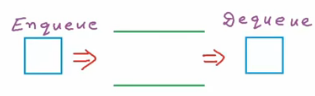
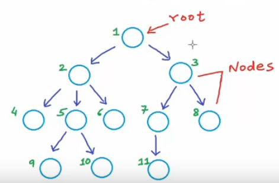
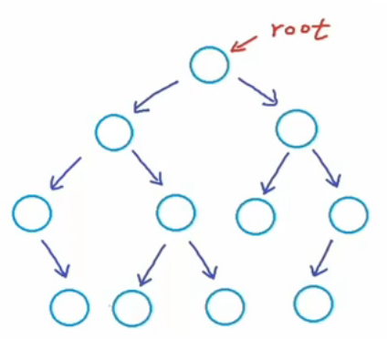
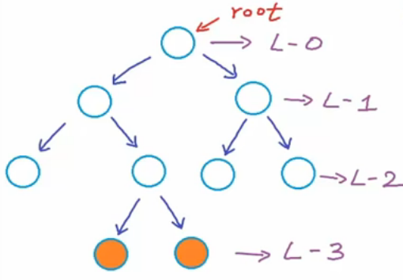
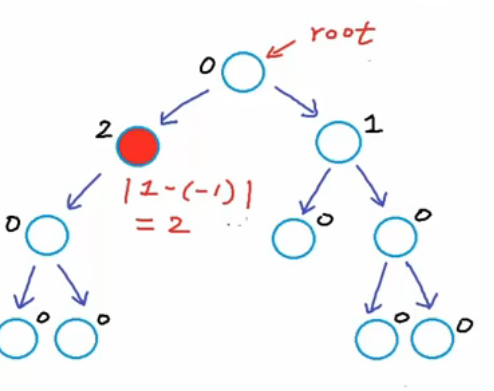
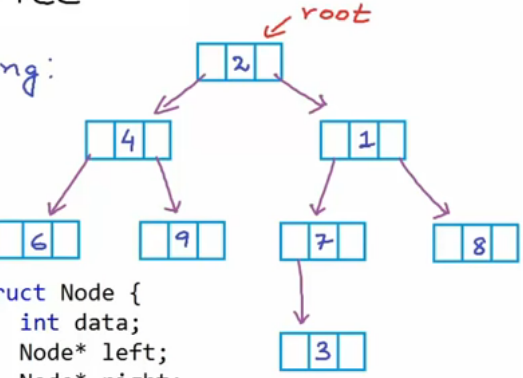
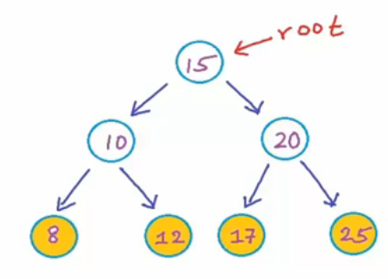
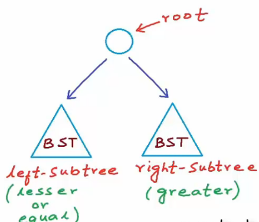
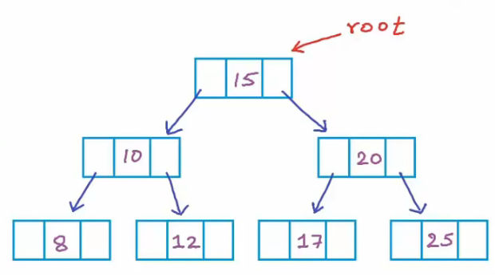
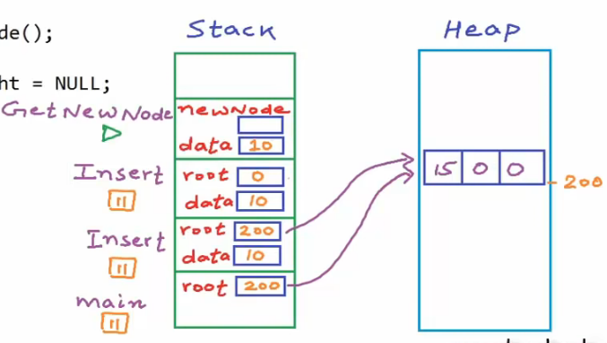

# My Code School

## Data Structures

### 21) Infix to Postfix using stack

(example of the use of stack - infix to postfix)

### 22) Data structures: Introduction to Queues

ADT - abstract data type - features/operations, not implementation.

Queue - **first-in-first-out (FIFO)**. Queue is a list or collection with the restriction that insertion can be performed at one end (rear) and deletion can be performed at other end (front).

Operations:

1) EnQueue(x) or Push(x);
2) DeQueue() or Pop();
3) front() or peak() - return element at the front;
4) IsEmpty();

The time conplexity of the operations should be O(1).

```C
void Enqueue(int x);
int Dequeue();
```



Queue is most often used in a scenario where there is a **shared resource** that's supposed to serve some request, but the resource can handle only one request at a time.

### 23) Data structures: Array implementation of Queue

We can implement queues using:

1) Arrays;
2) Linked Lists;

#### Array Implementation

```C++
int A[10];
front = -1;
rear  = -1;

isEmpty()
{
    if (front == -1 && rear == -1)
        return true;
    else
        return false;
}

enqueue(x)
{
    if isFull()
        return
    else if isEmpty()
    {
        front <- rear <- 0
    }
    else
    {
        rear <- rear + 1
    }
    A[rear] <- x
}

dequeu()
{
    if isEmpty()
        return;
    else if front == rear
        front <- rear <- -1
    else
        front <- front + 1
}

// circular interpretation of the arrray/queue
enqueue(x)
{
    if(rear + 1) % N == front
        return
    else if isEmpty()
    {
        front <- rear <- 0
    }
    else
    {
        rear <- (rear + 1) % N
    }
    A[rear] <- x
}

// dequeue in circular interpretation
dequeu()
{
    if isEmpty()
        return
    else if front == rear
        front <- raer <- -1
    else
        front <- (front + 1) % N
}

front()
{
    return A[front]
}
```

Time complexity - O(1).

What if array gets filled?

1) "sorry, queue is full"
2) Create a new array and copy data

### 24) Data structures: Linked List implementation of Queue

#### Linked List Implementation

Enqueue: O(n), Dequeue: O(1).

```C++
struct Node{
    int data;
    struct Node* next;
};

struct Node* front = NULL;
struct Node* rear = NULL;

void Enqueue(int x)
{
    struct Node* temp = (struct Node*)malloc(sizeof(struct Node*));
    temp->data = x;
    temp->next = NULL;
    if(front == NULL && rear == NULL){
        front = rear = temp;
        return;
    }
    rear->next = temp;
    rear = temp;
}

void Dequeue()
{
    struct Node* temp = front;
    if(front == NULL) return;
    if(front == rear){
        front = rear = NULL;
    }else{
        front = front->next;
    }

    free(temp);
}
```

### 25) Data structures: Introduction to Trees

Linear data structures: array, linked list, stack and queue.



Tree: recursive data structure.

**Depth** of x = lenght of path from root to x or number of edges in path from root to x. For example, the depth of root is zero. **Height** of x = number of edges in longest path from x to a leaf.

```C++
struct Node {
    int data;
    Node* left;
    Node* right;
};
```

Applications:

1) Storing naturally hierarchical data. Eg: - file system;
2) Organize data for quick search, insertion, deletion: eg: - binary serach trees;
3) Trien - dictionary;
4) Networking routing algorithms;

### 26) Data structures: Binary Tree



**Binary tree**: each node can have at most 2 children; **Strict/proper** binary tree: each node can have either 2 or 0 children;**Complete binary tree**: all levels except possibly the last are completely filled and all nodes are as left as possible;

Depth example:



Maximum number of nodes at level ```i```: ```i = 2^i```.

**Perfect binary tree**: all levels are complete:

- maximum number of nodes in a binary tree with height *h*: ```h = 2^(h + 1) - 1```;
- height of perfect binary tree with *n* nodes: ```h = log2(n + 1) - 1```;
- height of complete binary tree: ```h = |log2n|```;

**Balanced binary tree**: difference between height of left and right subtree for every node is not more than *k* (mostly 1). **Height**: number of edges in longest path from root to a leaf; Height of and empty tree = -1; height of tree with 1 node = 0; is valid: ```diff = |Hleft - Hright|```;



We can implement binary tree using:

#### a) dynamically created nodes;

```C++
struct Node{
    int data;
    Node* left;
    Node* right;
};
```



#### b) arrays

![tree array]](img/tree-array.png)

```C
for node at index i,
    left-child-index = 2i + 1
    right-child-index = 2i + 2
```

### 27) Data structures: Binary Search Tree

Binary search tree is an efficient structure to organize data for quick search as well as quick update.

- What data structure will you use to store a modifiable collection?

1) Array (sorted) - Search(x) = O(n), Insert(x) = O(1) and Remove(x) = O(n);
2) Linked List - Search(x) = O(n), Insert(x) = O(1) and Remove(x) = O(n);
3) Array (unsorted) - Search(x) = O(log(n)), Insert(x) = O(n) and Remove(x) = O(n);
4) Binary Search Tree (balanced) - Search(x) = O(log(n)), Insert(x) = O(log(n)), Remove(x) = O(log(n));

**Binary Search Tree (BST)** -  a binary tree in which for each node, value of all the nodes in left subtree is lesser (or equal) and value of all the nodes in right subtree is greater.


 
### 28) Binary search tree - Implementation in C/C++





```C++
struct BstNode {
    int data;
    BstNode* left;
    BstNode* right;
}

BstNode* rootPtr;

BstNode* GetNewNode(int data)
{
    BstNode* newNode = new BstNode(); // C++
    // BstNode* newNode = (BstNode*)malloc(sizeof(BstNode));
    newNode->data = data; // (*newNode).data = data
    newNode->left = newNode->right = NULL;
    return newNode;
}

BstNode* Insert(BstNode* root, int data)
{
    if(root == NULL){
        root = GetNewNode(data);
    }
    else if(data <= root->data){
        root->left = Insert(root->left, data);
    }
    else{
        root->right = Insert(root->right, data);
    }
    return root;
}

bool Search(BstNode* root, int data)
{
    if(root == NULL) return false;
    else if(root->data == data) return true;
    else if(data <= root->data) return Search(root->left, data);
    else return Search(root->right, data);
}

int main()
{
    BstNode* root = NULL; // creating empty tree
    root = Insert(root, 15);
    root = Insert(root, 10);
    root = Insert(root, 20);
    root = Insert(root, 25);
    root = Insert(root, 8);
    root = Insert(root, 12);

    // ask user to enter a number
    int number;
    cout << "Enter a number to be searched: ";
    cin >> number;
    if(Search(root, number) == true) cout << "Found\n";
    else cout << "Not Found\n";
}
```

Nodes will be created in heap using ```malloc``` function in C or ```new``` operator in C++.

### 29) BST implementation - memory allocation in stack and heap


