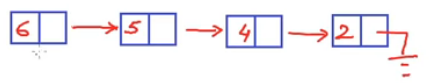

# My Code School

## Data Structures

### 1) Introduction to Data Structures

Data structure is the most fundamental and building block concept in computer science. Is a must to design and develop efficient software systems.

Exemples of organized data: dictionary, city map, cash book ...

A data structure is a way to store and organize data in a computer, so that it can be used efficiently. We talk about data structures as:

1) Mathematical/logical models (or abstract data types) - we look at an abstract view of them, from a high level what all features and what all operations define that particular data structure. Ex.: list - store a given number of elements, read elements by position, modify element at a position.
2) Implementation - ex.: implementations of a list in c/c++.

**Abstract data types** (ADTs) - define data and operations, but no implementation.

Exemples:

- Arrays
- Linked list
- Stack
- Queue
- Tree
- Graph

### 2) Data Structure: List as Abstract Data Type

List - collection of objects of the same type.

Exemple - List:

- store a given number of elements of given data-type;
- write/modify elements at a position;
- read element at a position;

Implementation: array can be a data structure that give us implementation for this list.

Exemple - List:

- empty list has size 0;
- insert;
- remove;
- count;
- read/modify element at a position;
- specify data-type;

Implementation:

```C
int A[MAX_SIZE];
int end = -1;

insert(2);
insert(4);
insert(6);
insert(8, 1);

remove(0);
```

- Access - read/write element at an index. Constant time: O(1);
- Insert - O(n);
- Remove - O(n);
- Add - O(n);

### 3) Introduction to Linked List

Exemple: a story about a programmer x memory manager. It basically show how hard it is to store an array that it's size may be changed in the future. Solving the problem: linked list have the value saved in a variable and the pointer that points to the next element.

```C
struct Node
{
    int data;
    Node* next;
}
```



Logical view of the linked list data structure - data is stored in these nodes and each node stores the data as well as the link to the next node so each node kind of points to the next node. The first node is called the head node - give us access to the complete list.

### 4) Data Structures: Arrays vs Linked Lists

There is no such thing as one data structure is better than another data structure. One data structure may be really good for one kind of requirement, while another data can be really good for another kind of requirement.

It all depends upon factors like what is the most frequent operation that you want that you want to perform with the data structure or what is the size of the data and there can be other other factors as well.

N  | Memory
---|------
208|b = 10
204|a = 4
   |
   |
   |
64 |p = 204

Item | ARRAY | LINKED LIST | Commentaries
-----|-------|-------------|-------------
Cost of accessing an element | Constant time - O(1) | Average case: O(n) | The cost of accessing an element, array scores heavily over linked list. If we have a requirement to access elements in a list all the time, **array** is a better choice.
Memory requirements | - Fixed size - Memory may note be available as one large block| - No unused memory - Extra memory for pointer variables - Memory may be available as multiple small blocks | Because the arrays have fixed size, once the array gets filled and we want to add more memory, then we have to create a new array of larger size
Cost of inserting an element | a) begenning: O(n) b) end: O(1) array not full, O(n) array full c) middle: O(n) | a) begenning: O(1) b) end: O(n) middle: O(n) | Deleting items have the same complexity
Easy to use | Easier | Harder

### 5) Linked List - Implementation in C/C++


### 6)

### 7)

### 8)