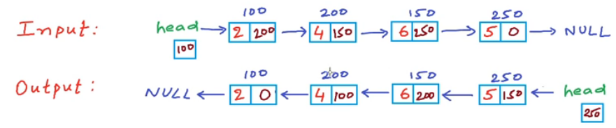
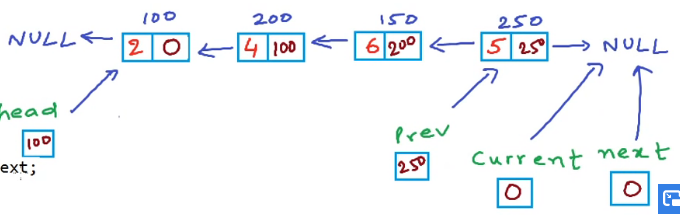
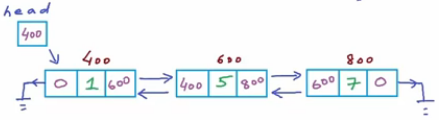

# My Code School

## Data Structures

### 1) Introduction to Data Structures

Data structure is the most fundamental and building block concept in computer science. Is a must to design and develop efficient software systems.

Exemples of organized data: dictionary, city map, cash book ...

A data structure is a way to store and organize data in a computer, so that it can be used efficiently. We talk about data structures as:

1) Mathematical/logical models (or abstract data types) - we look at an abstract view of them, from a high level what all features and what all operations define that particular data structure. Ex.: list - store a given number of elements, read elements by position, modify element at a position.
2) Implementation - ex.: implementations of a list in c/c++.

**Abstract data types** (ADTs) - define data and operations, but no implementation.

Exemples:

- Arrays
- Linked list
- Stack
- Queue
- Tree
- Graph

### 2) Data Structure: List as Abstract Data Type

List - collection of objects of the same type.

Exemple - List:

- store a given number of elements of given data-type;
- write/modify elements at a position;
- read element at a position;

Implementation: array can be a data structure that give us implementation for this list.

Exemple - List:

- empty list has size 0;
- insert;
- remove;
- count;
- read/modify element at a position;
- specify data-type;

Implementation:

```C
int A[MAX_SIZE];
int end = -1;

insert(2);
insert(4);
insert(6);
insert(8, 1);

remove(0);
```

- Access - read/write element at an index. Constant time: O(1);
- Insert - O(n);
- Remove - O(n);
- Add - O(n);

### 3) Introduction to Linked List

Exemple: a story about a programmer x memory manager. It basically show how hard it is to store an array that it's size may be changed in the future. Solving the problem: linked list have the value saved in a variable and the pointer that points to the next element.

```C
struct Node
{
    int data;
    Node* next;
}
```


Logical view of the linked list data structure - data is stored in these nodes and each node stores the data as well as the link to the next node so each node kind of points to the next node. The first node is called the head node - give us access to the complete list.

### 4) Data Structures: Arrays vs Linked Lists

There is no such thing as one data structure is better than another data structure. One data structure may be really good for one kind of requirement, while another data can be really good for another kind of requirement.

It all depends upon factors like what is the most frequent operation that you want that you want to perform with the data structure or what is the size of the data and there can be other other factors as well.

N  | Memory
---|------
208|b = 10
204|a = 4
 - | -
 - | - 
 - | -
64 |p = 204

Item | ARRAY | LINKED LIST | Commentaries
-----|-------|-------------|-------------
Cost of accessing an element | Constant time - O(1) | Average case: O(n) | The cost of accessing an element, array scores heavily over linked list. If we have a requirement to access elements in a list all the time, **array** is a better choice.
Memory requirements | - Fixed size - Memory may note be available as one large block| - No unused memory - Extra memory for pointer variables - Memory may be available as multiple small blocks | Because the arrays have fixed size, once the array gets filled and we want to add more memory, then we have to create a new array of larger size
Cost of inserting an element | a) begenning: O(n) b) end: O(1) array not full, O(n) array full c) middle: O(n) | a) begenning: O(1) b) end: O(n) middle: O(n) | Deleting items have the same complexity
Easy to use | Easier | Harder

### 5) Linked List - Implementation in C/C++

In a linked list, data is stored in multiple non-contiguous blocks of memory, we call each block of memory a **node**.

```C
struct Node
{
    int data;
    Node* next; // struct Node* next;
};

Node* A;
A = NULL;

Node* temp = (Node*)malloc(sizeof(Node)); // in C++: Node* temp = new Node();
(*temp).data = 2; // temp->data = 2;
(*temp).next = NULL; // temp->next = NULL;
A = temp;
```

OBS.: we will need a type casting because malloc returns ```void```.

### 6) Linked List in C/C++ - Inserting a Node at Beginning

```C
// Linked List: inserting a node at the beginning
#include<stdlib.h>
#include<stdio.h>

struct Node{
    int data;
    struct Node* next; // C++: Node* next
};

struct Node* head; // global variable

void Insert(int x)
{
    Node* temp = (Node*)malloc(sizeof(struct Node));
    temp->data = x; // (*temp).data = x;
    temp->next = head;
    head = temp;
}

void Print()
{
    struct Node* temp = temp; // temporary variable - do not modify head
    printf("List is: ");
    while(temp != NULL)
    {
        printf("%d ", temp->data);
        temp = temp->next;
    }
    printf("\n");
}

int main()
{
    head = NULL; // empty list

    printf("How many numbers?\n");
    int n, i;
    scanf("%d", &n);
    for(i = 0; i < n; i++)
    {
        scanf("%d", &x);
        Insert(x);
        Print();
    }

    return 0;
}
```

OBS.: if we do not declare the head as global, we have to pass this information to the functions.

```C
// Linked List: inserting a node at the beginning

Node* Insert(Node* head, int x)
{
    Node* temp = (Node*)malloc(sizeof(struct Node));
    temp->data = x; // (*temp).data = x;
    temp->next = head;
    head = temp;

    return head;
}

/* or:
void Insert(Node** pointerToHead, int x)
{
    Node* temp = (Node*)malloc(sizeof(struct Node));
    temp->data = x;
    temp->next = head;
    if(*pointerToHead != NULL) temp->next = *pointerToHead;
    head*pointerToHead = temp;

    return head;
}

in the main, we pass the head by reference:
Insert(&head, x);
*/

void Print(Node* head)
{
    printf("List is: ");
    while(head != NULL)
    {
        printf("%d ", head->data);
        head = head->next;
    }
    printf("\n");
}

int main()
{
    Node* head = NULL; // empty list

    printf("How many numbers?\n");
    int n, i;
    scanf("%d", &n);
    for(i = 0; i < n; i++)
    {
        scanf("%d", &x);
        head = Insert(x);
        Print(head);
    }

    return 0;
}
```

OBS.: if we do not declare the head as global, we have to pass this information to the functions.

### 7) Linked List in C/C++ - Insert a Node at Nth Position

```C
#include<stdlib.h>
#include<stdio.h>

struct Node{
    int data;
    struct Node* next;
};

struct Node* head; // global

void Insert(int data, int n)
{
    // C++: Node* temp1 = new Node();
    struct Node* temp1 = (struct Node*)malloc(sizeof(struct Node*)); // creating a new node
    temp1->data = data;
    temp1->next = NULL;
    if(n == 1)
    {
        temp1->next = head;
        head = temp1;r
        return;
    }

    Node* temp2 = head;
    for(int i = 0; i < n - 2; i++)
    {
        temp2 = temp2->next;
    }
    temp1->next = temp2->next;
    temp2->next = temp1;
}

void Print()
{
    Node* temp = head;
    while(temp != NULL)
    {
        printf("%d ", temp->data);
        temp = temp->next;
    }
    printf("\n");
}

int main()
{
    head = NULL; // empty list

    Insert(2, 1);
    Insert(3, 2);
    Insert(4, 1);
    Insert(5, 2);

    Print();

    return 0;
}
```

|Application Memory|
|------------------|
|Heap|
|Stack|
|Static/Global|
|Code (Text)|

The first three sections (code, Static, Stack) are fixed in size - decided at compile time.

- Code(text) - store all the instructions that need to be executed.
- Static/Global - this section is allocated to store the global variables that live for the entire lifetime of the program/application.
- Stack - store all the information about function call executions, to store all the local variables.
- Heap - free store - is not fixed an we can request memory from the heap during run-time and that's what we do whan we use malloc or ```new``` operator.

### 8) Linked List in C/C++ - Delete a Node at Nth Position

1) Fix the links.
2) Free the space.

```C
// Linked List: delete a node at nth position
#include<stdio.h>
#include<stdlib.h>

struct Node{
    int data;
    struct Node* next;
};

struct Node* head;

void Delete(int n)
{
    struct Node* temp1 = head;// temporary variable that is pointed to node

    if(n == 1){ // deleting head
        head = temp1->next; // head now points to second node
        free(temp1);
        return;
    }

    int i;
    for(i = 0; i < n-2; i++)
        temp1 = temp1->next;
    // temp1 points to (n-1)th Node
    struct Node* temp2 = temp1->next; // nth Node
    temp1->next = temp2->next; // (n+1)th Node
    free(temp2); // delete temp2;
}

void Insert(int data);
void Print();

int main()
{
    head = NULL; // list empty
    Insert(2);
    Insert(4);
    Insert(6);
    Insert(8);

    int n;
    printf("Enter a position:\n");
    scanf("%d", &n);

    Delete(n);
    Print();

    return 0;
}
```

### 9) Reverse a Linked List - Iterative Method



```C
struct Node
{
    int data;
    struct Node* next;
};

struct Node* head;

void Reverse()
{
    struct Node* head; // variable pointer to node
    struct Node* prev;
    struct Node* current;
    struct Node* next;

    current = head; // set it to head
    prev = NULL; // the first become the last - points to NULL

    while(current != NULL) // while temp is not equal to NULL
    {
        next = current->next; // store the address of the next in the point of view of the current
        current->next = prev; // current now points to previous

        prev = current;
        current = next;
    }
    head = prev;
}
```



```C
struct Node* Reverse(struct Node* head) // head variable is not global
{
    struct Node *current, *prev, *next;
    current = head;
    prev = NULL;

    while(current != NULL)
    {
        next = current->next;
        current->next = prev;
        prev = current;
        current = next;
    }
    head = prev;
    return head;
}

int main()
{
    struct Node* head = NULL; // head is local
    head = Insert(head, 2); // Insert: struct Node* Insert(struct Node* head, int data)
    head = Insert(head, 4);
    head = Insert(head, 6);
    head = Insert(head, 8);

    Print(head);
    head = Reverse(head);
    Print(head);

    return 0;
}
```

### 10) Print Elements of a Linked List in Forward and Reverse Order Using Recursion

```C
struct Node
{
    int data;
    struct Node* next;
};

struct Node* Insert(Node* head, int data)
{
    Node* temp = (struct Node*)malloc(sizeof(struct Node));
    temp->data = data;
    temp->next = NULL;

    if(head == NULL) head = temp;
    else
    {
        Node* temp1 = head;
        while(temp1->next != NULL) temp1 = temp1->next;
        temp1->next = temp;
    }
    return head;
}

void Print(struct Node* p)
{
    if(p == NULL) return; // exit condition

    printf("%d ", p->data);
    Print(p->next);
}

void ReversePrint(struct Node* p)
{
    if(p == NULL) return;

    ReversePrint(p->next);
    printf("%d ", p->data);
}

int main()
{
    struc Node* head = NULL;
    head = Insert(head, 2);
    head = Insert(head, 4);
    head = Insert(head, 6);
    head = Insert(head, 5);

    Print(head);

    return 0;
}
```

### 11) Reverse a Linked List Using Recursion


```C
struct Node{
    int data;
    struct Node* next;
}

struct Node* head; // head is a global variable - facilitate the code

void Reverse(struct Node* p)
{
    if(p->next == NULL)
    {
        head = p;
        return;
    }
    Reverse(p->next);
    struct Node* q = p->next;
    q->next = p;
    p->next = NULL;
}


void Reverse(struct Node* p)
{
    if(p->next == NULL)
    {
        head = p;
        return;
    }
    Reverse(p->next);
    p->next->next = p;
}
```

### 12) Data structures: Introduction to Doubly Linked List

In a doubly linked list, each Node would have two links - one to the next Node and another to the previous Node.

```C
struct Node{
    int data;
    struct Node* next;
    struct Node* prev;
};
```



First advantage of implementing a doubly linked list is that now we have pointer to any Node, then we can do a forward as well as reverse look-up. With just one pointer, we can look at the current Node, the next Node as well as the previous Node. If temp is a pointer pointing to a Node, then ```temp->next``` is a pointer pointing to the next Node.
So, even implementation of some of the operations like deletion becomes a lot easier. In a singly linked list, to delete a Node you would need two pointer - one to the Node to be deleted and one to the previous Node. But in a doubly linked list, we can do so using only one pointer to the Node to be deleted.

All in all this ability that we can do a reverse look-up in the linked list is really useful. We can flow through the linked list in both directions. The disadivantage is that we are having to use extra memory for a pointer to previous Node. With a doubly linked list, we also need to be more careul while resetting links, inserting or deleting.

### 13) Doubly Linked List - Implementation in C/C++

```C++
struct Node{
    int data;
    struct Node* next;
    struct Node* prev;
};

struct Node* head; // global variable

struct Node* GetNewNode(int x)
{
    /* reserves memory in heap
    access to this memory always happens through a pointer variable
    newNodePtr is a pointer */
    struct Node* newNodePtr = (struct Node*)malloc(sizeof(struct Node));

    newNodePtr->data = x; // (*newNodePtr).data = x;
    newNodePtr->prev = NULL;
    newNodePtr->next = NULL;

    return newNode;
}

void InsertAtHead(int x)
{
    struct Node* newNode = GetNewNode(x);
    if(head = NULL)
    {
        head = newNode;
        return;
    }
    head->prev = newNode;
    newNode->next = head;
    head = newNode;
}

void Print()
{
    struct Node* temp = head; // temporary pointer to node initially set to head
    while(temp != NULL)
    {
        printf("%d ", temp->data);
        temp = temp->next;
    }
    printf("\n");
}

void ReversePrint()
{
    struct Node* temp = head;
    it(temp == NULL) return; // empty list, exit

    // going to last node
    while(temp->next != NULL)
    {
        temp = temp->next;
    }

    // traversing backwards using prev pointer
    while(temp != NULL)
    {
        printf("%d ", temp->data);
        temp = temp->prev;
    }
    printf("\n");
}

int main()
{
    head = NULL; // empty list

    InsertAtHead(2); Print(); ReversePrint();
    InsertAtHead(4); Print(); ReversePrint();
    InsertAtHead(6); Print(); ReversePrint();

    return 0;
}
```

### 14) Data structures: Introduction to stack

Data structures, as we know, are ways to store and organize data in computers. When we talk about Stack ADT, we talk about the features or operations available with the data structure - no implementation details.

Stack is a list with the restriction that insertion and deletion can be performed only from one end, called the top.

- last-in first-out (LIFO)

Operations:

- Push(x): push (insert) ```x``` onto the stack
- Pop(x): pop (remove) the most recent item from the stack
- Top(): return elements of the top of the stack
- IsEmpty(): return true if the stack is empty

All these operations can be performed in constant time, time complexity is O(1).

Applications:

- Functions calls/recursion
- undo operation in an editor
- balanced parentheses: we can check this, for example using the stack in an program